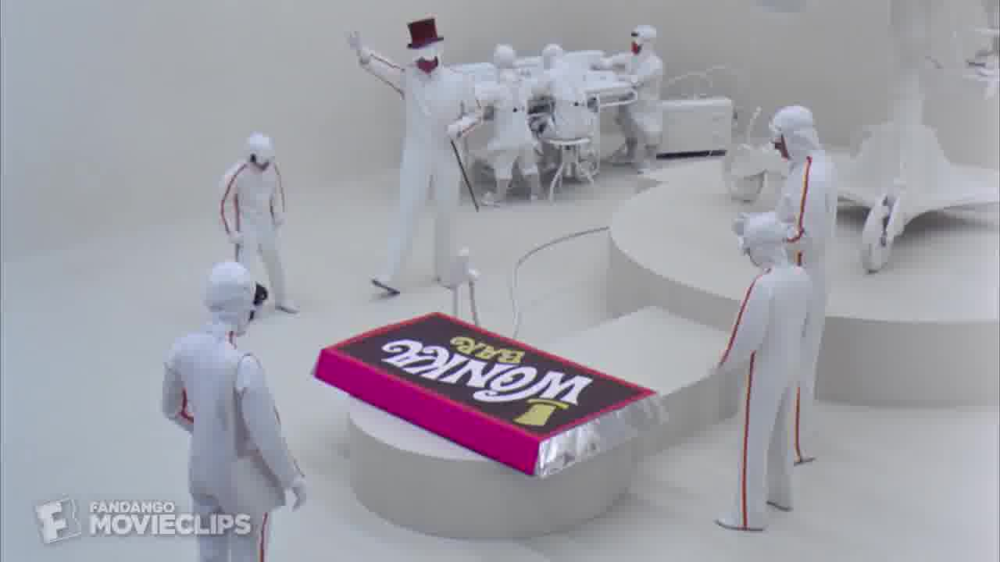
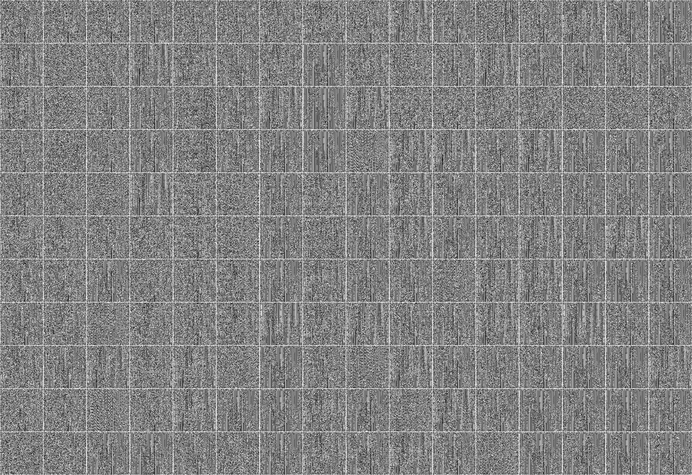
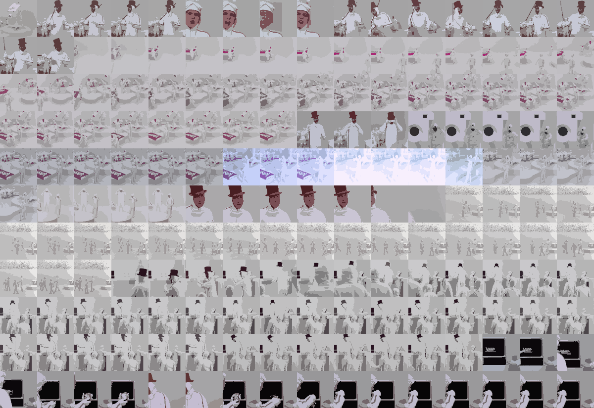
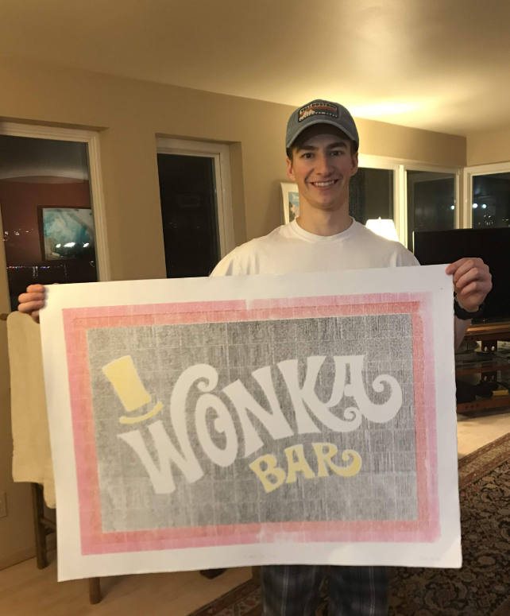
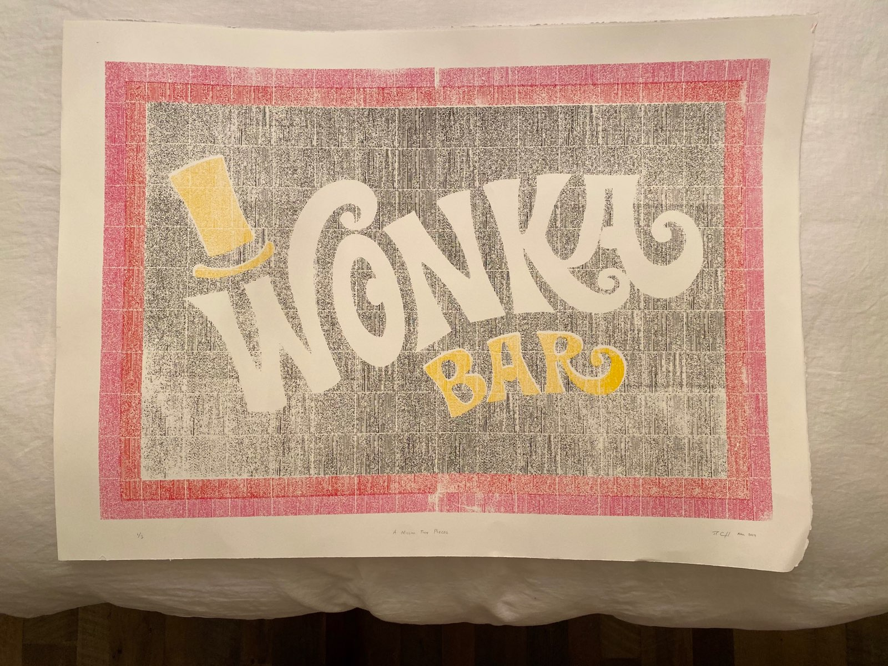
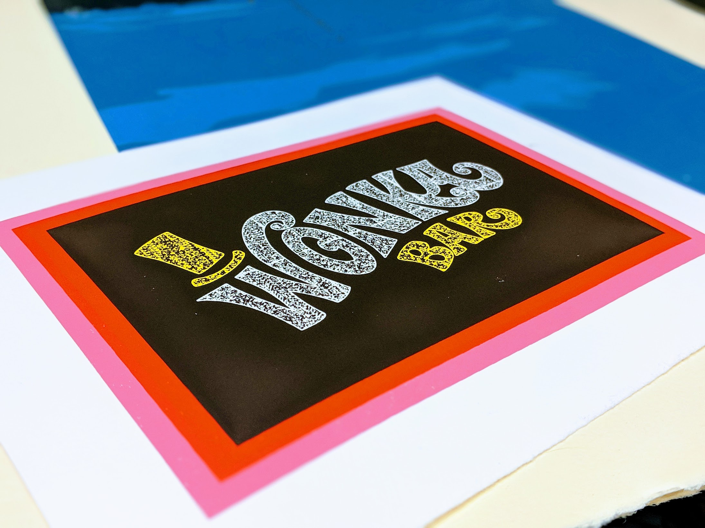
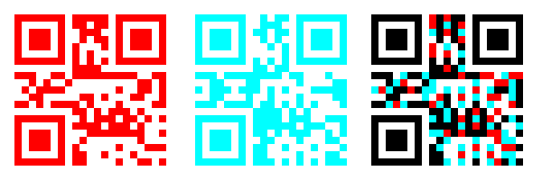
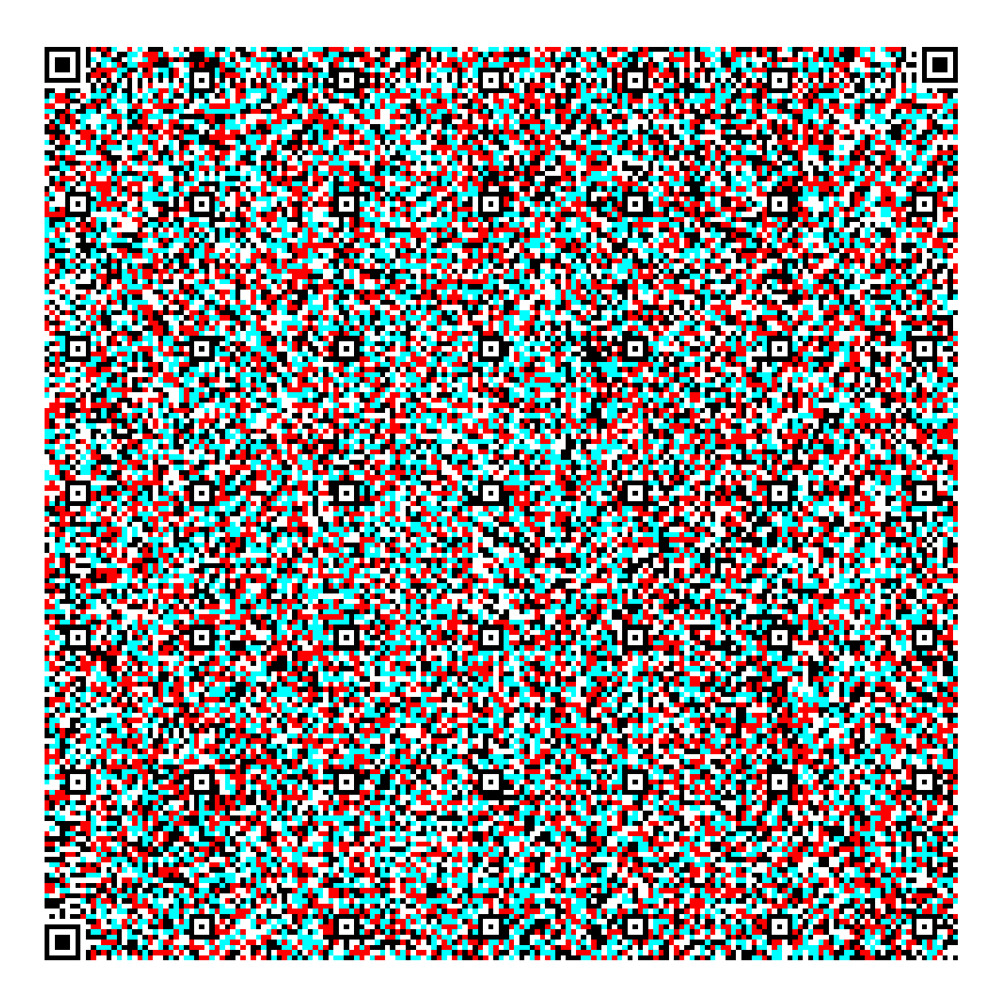
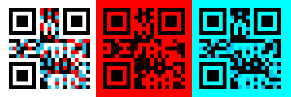

# Wonkavision


    WONKA: Wonkavision - My very latest and greatest invention.

    MIKE: It's television.

    WONKA: Uh, it's Wonkavision.  Now I suppose you all know how ordinary television works. You photograph something and--

    MIKE: Sure, I do. You photograph something and then the photograph is split up into millions of tiny pieces, and they go whizzing through the air down to your TV set where they're all put together again in the right order.

    WONKA: You should open your mouth a little wider when you speak.  So I said to myself, "If they can do it with a photograph, why can't I do it with a bar of chocolate?"  I shall now send this chocolate bar from one end of the room to the other.  It has to be big because whenever you transmit something by television, it always ends up smaller on the other end.  Goggles on, please.  Lights, camera, action!

    MRS. TEAVEE: (screams)

    WONKA: You can remove your goggles.

    CHARLIE: Where's the chocolate?

    WONKA: It's flying over our heads in a million pieces. Now watch the screen.  Here it comes. There it is. Take it.

    MIKE: How can you take it?  It's just a picture.

    WONKA: All right, you take it.

    CHARLIE: It's real.

    WONKA: Taste it; it's delicious. It's just gotten smaller, that's all.

    CHARLIE: It's perfect.

    MRS. TEAVEE: It's unbelievable.

    GRANDPA JOE: It's a miracle.

    MIKE: It's a TV dinner.

    WONKA: It's Wonkavision.

## TL;DR
* [Movie  Scene](https://www.youtube.com/watch?v=pvS3j8VtanM)
* Mike Teavee claims television works by splitting data into millions of tiny pieces, which whiz through the air down to your TV set, and are put together again in the right order. 
* The data has to be big because whenever you transmit something by television, it always ends up smaller on the other end.

In the words of Willy Wonka himself... **if they can do it with a photograph, why can't I do it with ~~a bar of chocolate~~ the movie screen printed onto a 4'x'3 bar of chocolate?**

## Screen Printing
Screen printing is a method to print images by hand. A print is composed of multiple layers that you create by passing ink through a screen which has stencils burned into it.


From [Wiki](https://en.wikipedia.org/wiki/Screen_printing)
> Screen printing is a printing technique where a mesh is used to transfer ink onto a substrate, except in areas made impermeable to the ink by a blocking stencil. A blade or squeegee is moved across the screen to fill the open mesh apertures with ink, and a reverse stroke then causes the screen to touch the substrate momentarily along a line of contact. This causes the ink to wet the substrate and be pulled out of the mesh apertures as the screen springs back after the blade has passed. One color is printed at a time, so several screens can be used to produce a multicolored image or design.

## Project Goal
Encode the Wonkavision scene into a "chocolate bar" with the ability to decode the scene i.e. "put [it] together again in the right order."

**Disclaimer**: I wrote this about eight months after doing the project so some figures may be off -- but **the figures do not need to be precise to communicate the project's challenges and intentions effectively.**

## Challenges
* How can I encode as much information as possible onto a canvas?
* What dpi/resolution can I screen print?
* What is the best way to decode my data?
* What if there are errors in my printing?
* Images take up a lot of space
* Screen printing on a large canvas is much harder than a small canvas

## Encoding the Data
My canvas is 42" x 33" because I will save some room for stylistic padding. This is typical for screen printing. My screen has a mesh count (threads per inch) of 280, which translates to about 110 dots-per-inch (DPI). The amount of data I can store in 110 DPI is determined by how many colors I use. In the context of Information Theory, this is the radix.

### Two Colors?
If I use two colors, white & black, then a single dot is analogous to a bit. This simple isomorphism results in `110^2` ~ 1.5kB per inch. There are `42x33=1386 in^2` of the printing surface, and I can fit  2.1 MB on the canvas. This is bad news considering the compressed one minute movie scene is 8.4 MB, which is already impressively small for a video.

### 256 Colors?
What if we made a dot on our canvas equivalent to a byte by using 256 different colors? The number of dots~bytes we can fit on a page is `110^2*42*33` which is 16.8 MB (8x the previous calculation). Great news! We can fit the scene. Unfortunately, screen printing 255 layers is incredibly impractical and would take hundreds of hours and cost nearly a thousand dollars in transparent stencils and ink. This is not an option.

### 16 Colors?
If we make the color of a dot corresponds to a hexadecimal value 0-15, then we can encode a byte in every two dots. This would allow us to store half as much data as 256 colors, which is exactly 8.4 MB -- enough to store the scene! *Crazy* how that works out (;

Unfortunately, there is a problem. I could print 15 layers (paper-white is a color). It would be exhausting, but it is feasible. The real problem is that this encoding does not have error correction and does not have a convenient way to decode. To decode this, I would have to create a scanner that can recognize the 16 different colors as well as be resilient to variations in the colors. This is possible; tricky, but possible. The real concern is the lack of error correction because the printing process is manual, and it is significantly harder to screenprint on a massive canvas such as this.

### QR Codes
This project requires that I can quickly decode data in an encoding that has redundancy. How about a bar code? How about a 2D bar code.. how about .. a [QR Code](QR_code)! There are many types of QR codes, but I want [the one](https://vignette.wikia.nocookie.net/matrix/images/3/32/Neo.jpg/revision/latest?cb=20060715235228) that can hold the most data. This is a 40x40 QR code which has the dimensions of 177x177. So I cannot make them 1"x1" since my DPI is only 110 .. more on this later. You can find QR code details [here](https://www.qrcode.com/en/about/version.html). In a 40x40 QR code, I have four redundancy options with the capacity depending on which type of data I encode.

| Redundancy | Binary (bytes) | Alphanumeric (chars) |
| ---------- | -------------- | -------------------- |
| L          | 2,953          | 4,296                |
| M          | 2,331          | 3,391                |
| Q          | 1,663          | 2,420                |
| H          | 1,273          | 1,852                |

I must compromise. I cannot make the QR codes 1-inch because the DPI of my screen is too low. Therefore, I must make the QR codes 2-inches which decreases my total capacity by 4. Ugh. So, instead of storing the whole movie scene and having to connect the chunked file, I am going to store one frame per QR code. In practice, this is much nicer because I can decode a single QR code and see the result. In the other case, you would have to scan every QR code on the canvas before getting the result.


### Which QR code size is best?
Screen printing allows you to print impressively high-resolution images, so printing and scanning codes should be no problem. Through trial and error, I tested how much data I could put it into as little space as possible. I created a grid of twelve QR codes based upon two features: size and error correction level. I then manually screen printed these and tested scanning them with my phone. The results are below. An "x" denotes that the code scanned successfully.

| Err. Corr. Lvl. | 1 in. | 2 in. | 3 in. |
| --------------- | ----- | ----- | ----- |
| Low             |       |       | x     |
| Med             |       |       | x     |
| Q               |       | x     | x     |
| High            |       | x     | x     |

I was pleasantly surprised with the results; however, this wasn't a perfect test. I used a smaller screen with a higher resolution (threads per inch). These trials were intentionally not perfect and were done for ballparking and assessing feasibility. The smaller screen is much easier to print with, and I hadn't received the larger screens at the time of testing. The thread count of my smaller screen is marginally higher than the larger screen's thread count, so the trials were still very useful. I decided to move forward with the 2-inch codes with high error correction because they maximize storage space while being the most resilient to printing errors. I did not want to use the Q level error-correcting codes, because the medium level 2-inch codes do not scan when printed with the higher-resolution screen. Using codes with higher redudancy grants me a safety buffer.

## Decoding the Data
I wanted to encode the bytes of a png into the QR and have a scanner that reads the bytes and renders the image. For this, I modified an [example](https://pub.dev/packages/fast_qr_reader_view#-example-tab-) QR reader mobile app which you can find in the `viewer/` directory. It is a [Flutter](https://flutter.dev/) application so you can run it on both iOS and Android. My change is simply:

```
# pseudocode
void onCodeRead(String data) {
 pngBytes = base64Decode(data)
 renderImage(pngBytes)
}
```

## Why is the data in base64?
The QR reader library did not play well with raw bytes. Data was encoding and decoded through the following procedure:
1. Convert png image to base64
1. Encode in QR code
1. Screen Print
1. Scan as ascii
1. Decode base64
1. Render png

## Constructing the Image
Now that I've ~~solved~~ compromised on the problem, I need to gather my images and prepare them. I need to compress and image so that it is only a single kilobyte and able to fit into a QR code. This is quite tough and involved massively downsizing the image and downsampling the colors. In the `wonka/assets` directory you can find the full steps for producing these images in the readme. The process outline is:

```
# Take 5 frames per second from the video
ffmpeg -i ./video.mp4 -vf fps=5 ./frames/%04d.jpg

# Cropping 1280x720 to 720x720
# - Offset x-coordinate by (1280-720)=560
# - Convert to png
ffmpeg -i image.jpg -vf "crop=720:720:560:0" cropped.png

# Scale cropped images
ffmpeg -i cropped.png -vf scale=75:75 "scaled.png"

# Downsample Images to 4 colors
# pngquant without dithering gives best compression size
pngquant --nofs --speed=1 --output="./compressed/scaled.png" 4 "downsampled.png"

# Convert to base64
base64 ./downsampled.png > image.txt
```

Here's a before and after. I quite like the pixel-art look of the resultant images.




## The Process

I wrote a simple python script to generate an appropriately sized grid of 2" QR codes at the HIGH redundancy level based upon the converted images from the previous step.

### Base



### Apply Style


### Decoded View



## Screen Printing




## Bonus Mini Print
I decided to also make a "to-scale" Wonkabar with a reference to the project.



# Intresting Extras!

## Three Color QR Codes
I am now able to quickly decode the information as well as encode with error correction to account for errors in the printing process. However, I have 1/4 the capacity because a 2" QR code takes up 4x as much space as a 1" QR code. What if I can encode two images into the space of a single QR code? I got this idea from anaglyph 3D (blue & red glasses) where you can put two different images (perspectives) together and filter one out for each eye. Let's try this with QR codes! The images below correspond to a blue lens filter, red lens filter, and no filter.




Try these out with your phone's camera, and if you have 3D glasses, you should be able to scan both codes on the combined code where the data in the code matches the color of the filter you use. What about for a 40x40?



For the brave few that scanned the 40x40, the data may look a bit odd; it's in base64.

## Screen Printing 3D QR Codes

It is important to understand color models to make sense of the challenges of screen printing anaglyph images. The two-color models I have been working with are RGB (displays) and CMYK (print).
```
RGB ~ Red, Green, Blue
CMYK ~ Cyan, Magenta, Yellow, blacK
```
The first is an additive model, and the second is a subtractive model. The type of model describes how colors combine. In the RGB model, mixing two colors adds their intensities together. On the other hand, colors mixed in the CMYK model subtract from one another's intensity. More detail on CMYK [here](http://hyperphysics.phy-astr.gsu.edu/hbase/vision/subcol.html). I will represent RGB colors by `RGB(0-255,0-255,0-255)` and CMYK colors by `CMYK(0-255,0-255,0-255,0-255)`. Examples:
```
# red
RGB(255, 0, 0) ~ #FF0000 ~ CMYK(0, 255, 255, 0)

# cyan
CMYK(255, 0, 0, 0) ~ RGB(0, 255, 255)

# white! -- odd right? we'll see how this plays out
RGB(255, 255, 255) ~ CMYK(0, 0, 0, 0)
```
Notice how cyan in the CMYK model corresponds to full green and blue in the RGB model. Anaglyph 3D glasses are designed to filter light coming from displays (tv's, computers, etc.) in the RGB model. One eye gets all of the red, and the other eye gets the green and blue. Your brain combines these images into full-color. If I want to make my scanning work for both colors, I need to print perfect red and cyan.

There is a technique in screen printing generally referred to as [CMYK](https://en.wikipedia.org/wiki/CMYK_color_model) in which the CMYK color is used to produce full-color images. This is the same technique used by inkjet printers ([cartrige](https://en.wikipedia.org/wiki/File:Canon_S520_ink_jet_printer_-_opened.jpg)). One must print four layers -- a layer for each base color -- and then the layers are combined into a full-color result.


We use "process" colors to produce CMYK images. A process color is a pure base color meant to be combined in a multi-layer printing process. This means I can get perfect cyan by using the process cyan. Fortunately, our shop had a pure red, so I did not need to mix the process magenta and process yellow. At this point, things are lining up.

I printed some 3D QR codes, and the red scanned, but the cyan was not being entirely filtered out. This meant I could only scan one of the two codes. It then occurred to me that the process cyan is premixed with **transparent base** (a clear ink to make the color moderately transparent) which was allowing some of the white into the mix. This is a bit odd, but here's my analysis.

This issue is easier to discover when using the RGB model because it more closely shows what gets passed through the glasses/filters.
```
# Let L = canvas color
# Let R = layer color
# Let T = layer color alpha (tranparency) [0.0-1.0]
# 
# Weighted Avg. Model:
# L + R = (1 - T) * L + T * R
```
**Example**
```
# Add blue at 50% transparency to a green canvas.
.5 * RGB(0, 255, 0) + .5 * RGB(0, 0, 255) = RGB(0, 128, 128)
```


After looking more into the makeup of process cyan, I see why the filtering fails. Take a look [here](https://en.wikipedia.org/wiki/Cyan#Process_cyan). Wiki says process cyan has the profile `CMYK(255, 56, 0, 20)`. Note, the wiki page normalized the color on a scale of 0-100 and I scaled it to 0-255 for consistency. The first problem I see is that process cyan has a bit of magenta. The second problem is that process cyan is a bit transparent with an alpha of ~0.85 which corresponds to about 15% transparency. What happens when this is printed onto paper-white?
```
# Paper-white + process cyan
0.15 * CMYK(0, 0, 0, 0) + 0.85 * CMYK(255, 56, 0, 20) = CMYK(217, 47, 0, 17)

# Convert process cyan into rgb
CMYK(255, 56, 0, 20) ~ RGB(0, 183, 235)

# Same calculation in RGB space
0.15 * RGB(255, 255, 255) + 0.85 * RGB(0, 183, 235) = RGB(38, 194, 238) 
```
If you look at the RGB calculation, the problem is obvious. The resultant value for the red component (38) is non-zero! What happens when I apply my cyan filter when trying to scan a code?
```
# process cyan on paper-white with a cyan filter
RGB(38, 194, 238) - RGB(0, 255,  255) = RGB(38, 0, 0)
```
I've recreated this digitally by adjusting the cyan in my combined QR codes to the color value of process cyan printed on paper-white. This is what the scanner sees with no filter, red filter, and a cyan filter.



The lingering little blue squares in the third panel have too much contrast against the background, so the scanner fails to read them.

I know that this method [can be done](https://twistedsifter.files.wordpress.com/2018/09/double-exposure-3d-glasses-street-art-by-insane51-cover.jpg), but with the inks and time I had, I could not pull it off. To make this work, I needed a non-transparent process cyan so that no white from the paper leaked through the filter. But this is a blessing in disguise! This method limited my use of color, so it would have been rather difficult to recreate a colorful Wonkabar with these red and cyan codes.